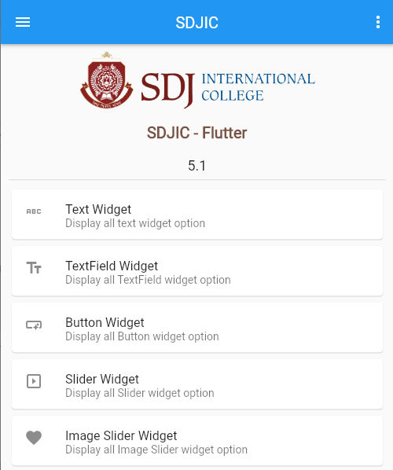
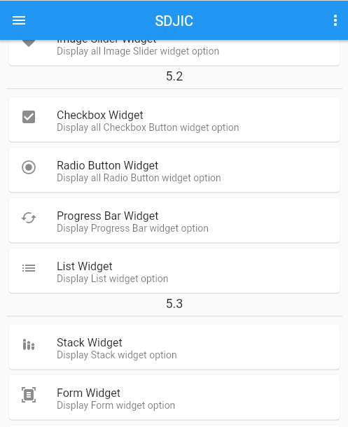
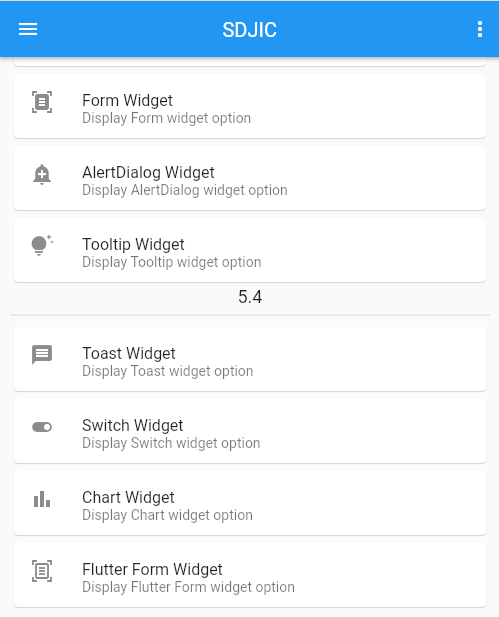

# Flutter Application - SDJIC

A flutter application for learning flutter widgets in SYBCA Sem 4 & 5.

## Setup
Clone the repository and run the following commands:
```
flutter pub get
flutter run
```

## ScreenShot

&nbsp;
&nbsp;
&nbsp;

## Links

* [Website](https://nehalpatel.in)
* [Github](https://github.com/nehalpatel)